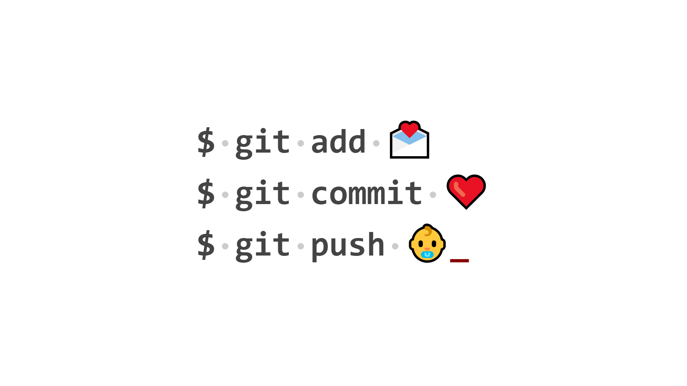
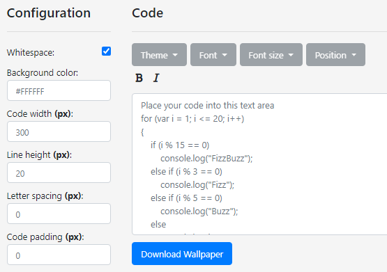
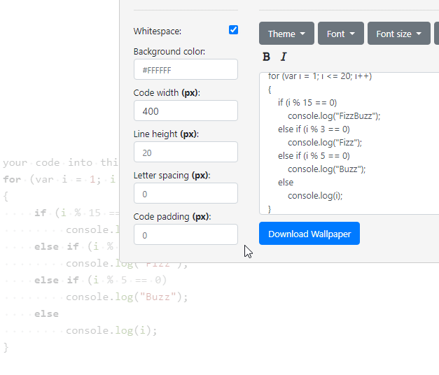

  

<h3 align="center">Code Wallpaper Generator</h3>

## 📝 Table of Contents

* [About](#about)
* [Getting Started](#getting-started)
* [Credits](#credits)
* [Contribution](#contribution)

## 🧐 About 

This application lets you create a wallpaper based on code you give it and by manipulating different parameters that change how the text and background looks. You can pick from all sorts of themes and fonts for your code and tweak the wallpaper until you're satisfied.

## 🏁 Getting Started 

To use the application, you first paste a block of code in the text area, and then set the width of the code block from the interface panel on the left. Without setting the width of the block, you won't be able to position it in different places on the screen.

After you have code in the text area, you will then be able to change its behavior from the buttons above it. To look at the wallpaper, you can hover over the background with your mouse and it will focus on it:

When you're done tweaking the wallpaper to your liking, simply click the download button and the image will be downloaded onto your device.

## ❤️ Credits 

Thanks to https://www.programmingfonts.org/ I was able to find a good number of fonts that you can use for programming code. I didn't want google fonts since they don't all match code.

Thanks to [https://highlightjs.org/](https://highlightjs.org/) for providing themes for code and also syntax highlighting, which this application would not have been possible without unless I spent a lot of time doing that myself.

## 🎁 Contribution 

If you want to extend the functionality of the application, please don't hesitate to send me changes to approve. If you wish you can also fork it. To work with this project specifically, you have to first ``$ gulp watch`` when you clone the application, so that the stylus files are automatically converted and compressed to CSS.
